<div align="center">
  <a href="https://github.com/ddgiovinazzo/vigil-desk">
    
  </a>
  <h1>VigilDesk</h1>
  <p><strong>Autonomous Enterprise Support Triage Agent &amp; RAG Knowledge Service</strong></p>

  <p>
    <a href="https://github.com/ddgiovinazzo/vigil-desk/actions"></a>
    <a href="https://python.org"></a>
    <a href="https://flask.palletsprojects.com/"></a>
    <a href="https://react.dev/"></a>
    <a href="https://www.postgresql.org/"></a>
    <a href="./LICENSE"></a>
  </p>

  <br/>

  <a href="#-demos--visual-showcase">
    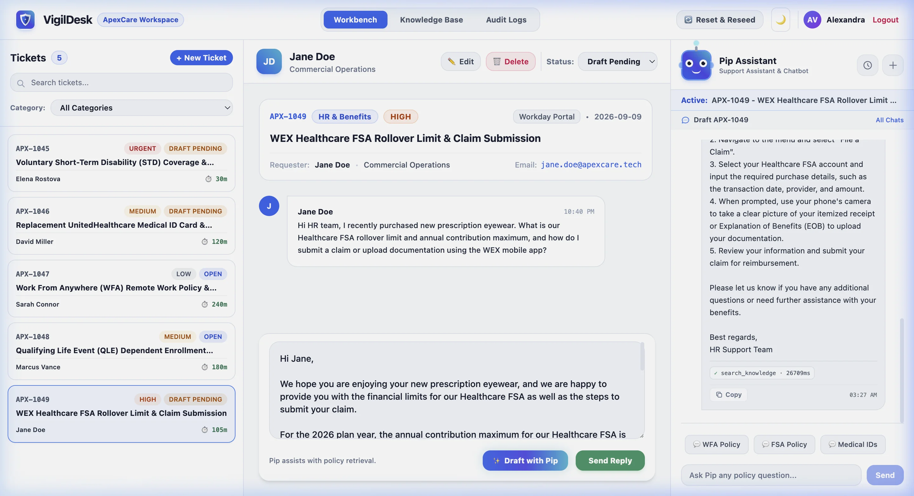
  </a>
  <p><i>The VigilDesk Unified Triage Cockpit: Live SLA Ticket Queue, Interactive Ticket Workbench, and Context-Aware Pip AI Copilot.</i></p>
</div>


> **💡 The Problem:** In enterprise IT and HR operations, support specialists spend up to **40% of their workday** manually hunting down fragmented policy documents across wikis and PDFs. This friction leads to inconsistent answers, slow ticket resolution times, and agent burnout.
> 
> **🎯 The Solution:** **VigilDesk** is a production-grade, multi-tenant **Autonomous AI Support Triage Agent** and **RAG Knowledge Service** built from first principles using Python/Flask and React (TypeScript). It automates policy retrieval, drafts grounded responses with an embedded copilot (**Pip**), and keeps specialists firmly in control through a **bounded reasoning loop**, **stateful Human-in-the-Loop (HITL) safety**, **prompt injection defense boundaries**, **dynamic multi-tenant company customization**, and comprehensive **observability & audit telemetry**.

<details>
  <summary><b>📑 Table of Contents (Click to expand)</b></summary>

  - [🎥 Demos & Visual Showcase](#-demos--visual-showcase)
  - [📱 Mobile & Cross-Platform Ergonomics](#-mobile--cross-platform-ergonomics)
  - [🏗️ System Architecture](#️-system-architecture)
  - [🌟 Key Engineering Highlights](#-key-engineering-highlights)
  - [🛡️ AI Safety & Prompt Injection Protection](#️-ai-safety--prompt-injection-protection)
  - [🛠️ Tech Stack](#️-tech-stack)
  - [🧭 Claude Code Harness (`.claude/`)](#-claude-code-harness-claude)
  - [🚀 Quick Start & Installation](#-quick-start--installation)
  - [🧪 Testing & Validation](#-testing--validation)
  - [👥 Authors & Team](#-authors--team)
  - [📄 License](#-license)
</details>

---

## 🎥 Demos & Visual Showcase

> [!TIP]
> **Core Concept:** Rather than leaving the support specialist in a generic chat interface, VigilDesk introduces a unified **Ticket Triage Workbench** dashboard. The agent acts as an embedded assistant directly grounding replies with policy retrieval and compiling draft responses, with every reasoning step audited and trace-logged.

### 🎬 Live Demo: Copilot Policy Grounding & Reply Drafting
<div align="center">
  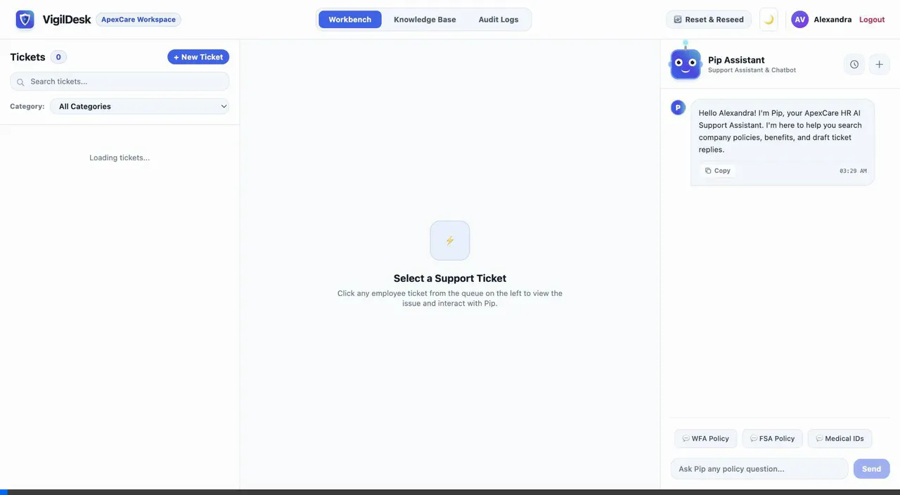
  <p><i>Live demonstration: Triggering "Draft with Pip" on an active ticket, retrieving grounded policy knowledge via RAG, streaming intermediate reasoning steps, and copying the generated draft directly into the reply editor.</i></p>
</div>

<br/>

### 🤖 Pip Assistant: 3-in-1 Copilot Capabilities
<div align="center">
  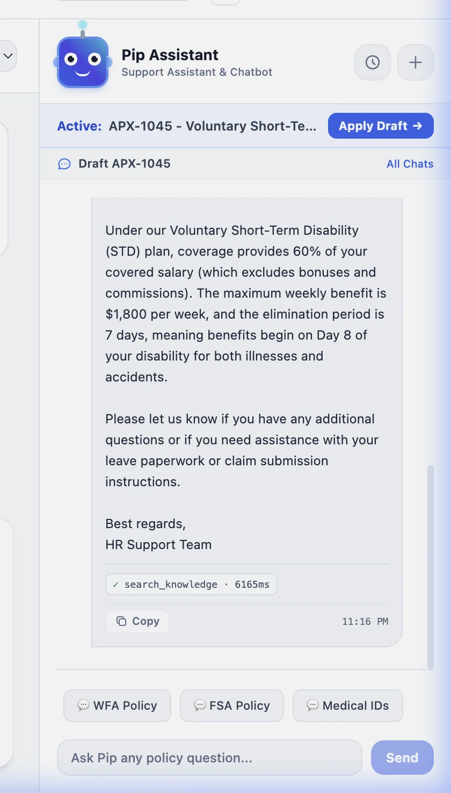
</div>

The embedded **Pip Assistant** serves as an intelligent sidekick equipped with three primary operational modes:
* **💬 1. General HR/IT Q&A:** Direct conversational reasoning to answer specialist queries and troubleshoot edge cases.
* **🔍 2. Autonomous Knowledge Base Search:** Triggers the `search_knowledge` tool to semantically retrieve relevant sections from indexed policy documents with live execution traces.
* **✍️ 3. Grounded Reply Drafting:** Synthesizes policy constraints into polite, structured customer responses with one-click **"Copy"** and direct workbench integration.

<br/>

### 📚 Policy Knowledge Base & RAG Retrieval
<div align="center">
  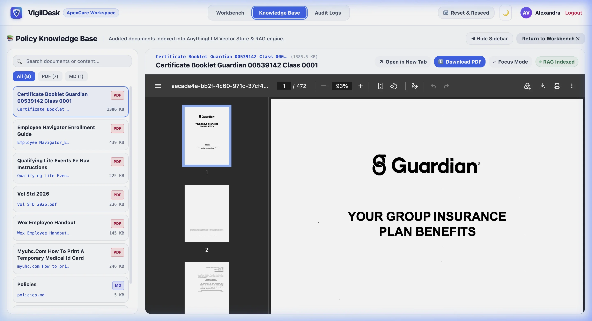
  <p><i>Interactive Knowledge Base viewer displaying company policies (Markdown & PDFs) synchronized and indexed into the AnythingLLM vector engine.</i></p>
</div>

<br/>

### 📊 System Analytics & Observability Dashboard
<div align="center">
  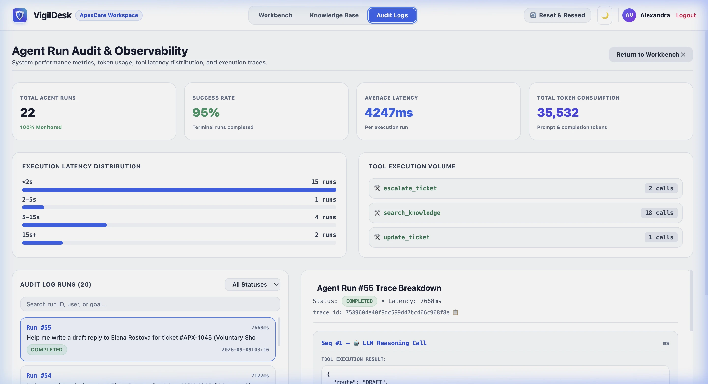
  <p><i>Real-time observability panel monitoring agent execution latency distributions, token volume consumption, success rates, and granular step-by-step traces.</i></p>
</div>

<br/>

### 🔐 Authentication & Recruiter 1-Click Demo Mode
<div align="center">
  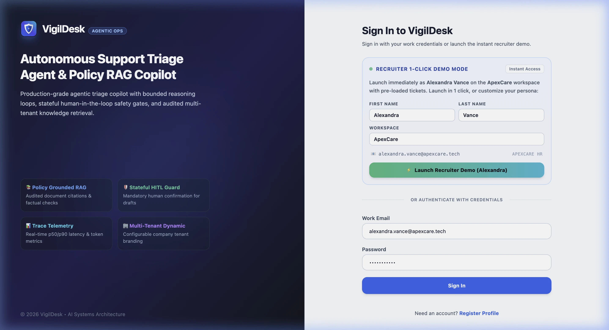
  <p><i>Authentication portal equipped with an instant "Recruiter Demo Mode" button to launch the live demo environment immediately with pre-loaded tickets.</i></p>
</div>

<br/>

### 🧭 Interactive Guided Tour & Onboarding
<div align="center">
  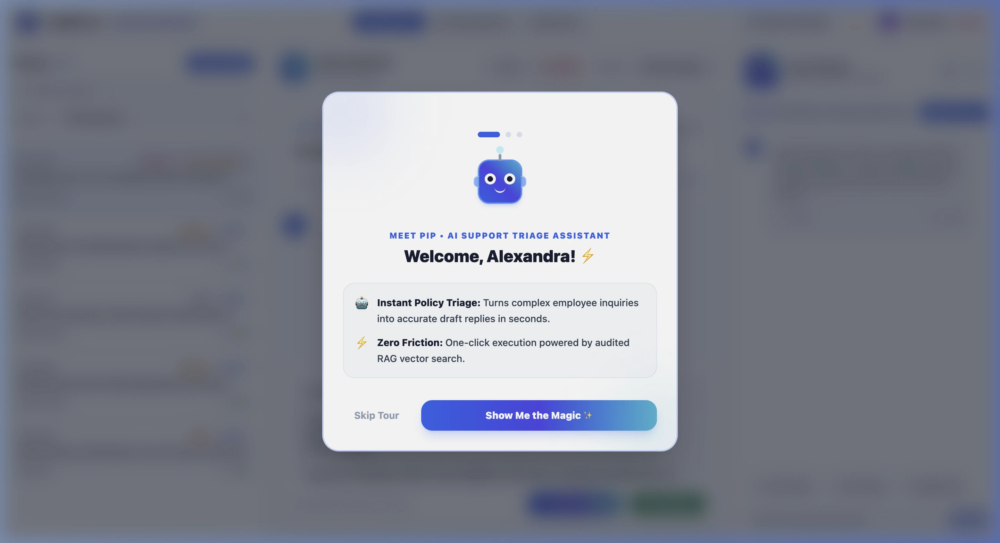
  <p><i>Interactive walkthrough modal guiding new specialists through ticket selection, Pip Copilot drafting, and knowledge exploration.</i></p>
</div>

---

## 📱 Mobile & Cross-Platform Ergonomics

> [!IMPORTANT]
> **Mobile as a First-Class Citizen:** Enterprise support specialists frequently need to triage urgent escalations and approve AI actions while on call or away from their desks. VigilDesk rejects the "desktop afterthought" paradigm in favor of a dedicated **Master-Detail & Hybrid Copilot** mobile architecture designed specifically for thumb accessibility and single-column focus.

<table align="center" width="100%" style="border-collapse: collapse; border: none;">
  <tr>
    <td align="center" width="25%" style="vertical-align: top; padding: 6px;">
      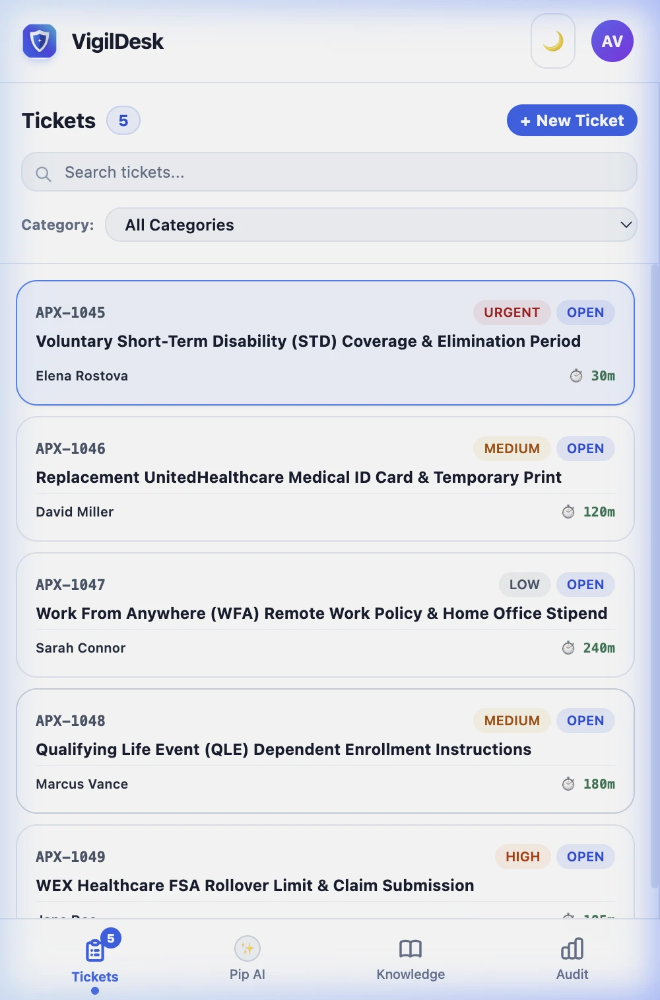<br/>
      <p style="margin-top: 6px;"><b>1. Triage Inbox</b><br/><sub style="color: #64748b;">Full-width cards with SLA timers &amp; priority tags</sub></p>
    </td>
    <td align="center" width="25%" style="vertical-align: top; padding: 6px;">
      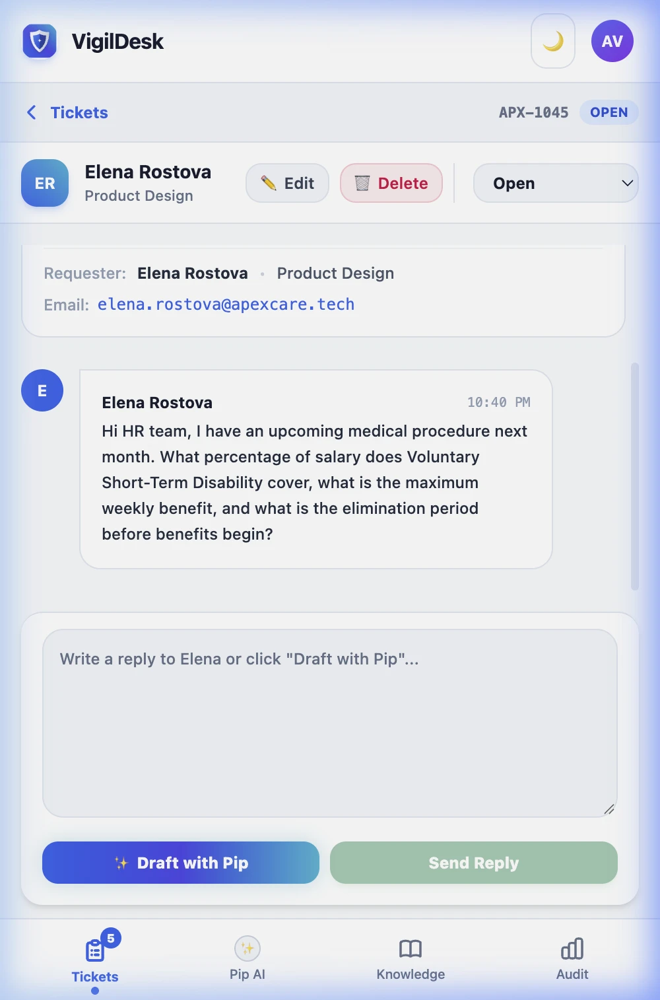<br/>
      <p style="margin-top: 6px;"><b>2. Focused Detail</b><br/><sub style="color: #64748b;">Collapsible metadata &amp; locked bottom composer</sub></p>
    </td>
    <td align="center" width="25%" style="vertical-align: top; padding: 6px;">
      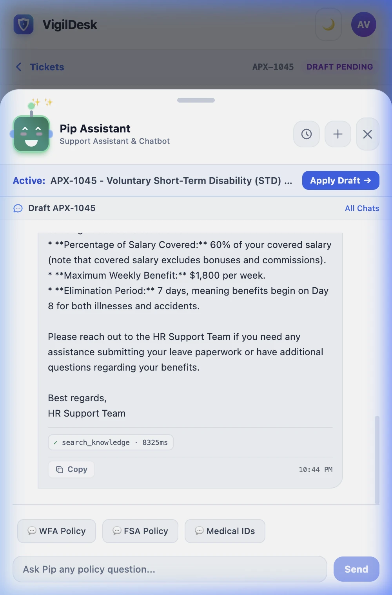<br/>
      <p style="margin-top: 6px;"><b>3. 85% Copilot Drawer</b><br/><sub style="color: #64748b;">Contextual grounding &amp; 1-tap "Apply Draft →"</sub></p>
    </td>
    <td align="center" width="25%" style="vertical-align: top; padding: 6px;">
      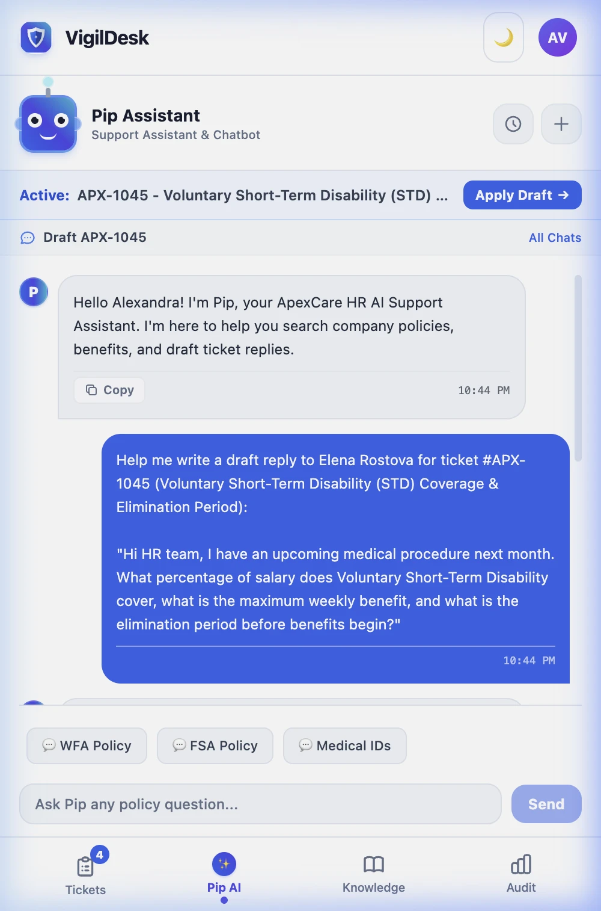<br/>
      <p style="margin-top: 6px;"><b>4. Full-Screen Pip</b><br/><sub style="color: #64748b;">Dedicated handbook policy Q&amp;A &amp; prompt pills</sub></p>
    </td>
  </tr>
</table>

### 🎯 Key Mobile Engineering Feats
1. **Fluid Master-Detail Navigation (`Inbox ⇄ Detail`)**: On mobile viewports (`<768px`), the 3-column desktop layout automatically transforms into a 1-column focused view. Tapping any ticket fluidly pushes to the full-screen Ticket Workbench with an instant `← Tickets` header back button.
2. **Contextual 85% Sliding Copilot Drawer**: Triggering **"✨ Draft with Pip"** from an active ticket does not navigate the specialist away. Instead, a native 85%-height sliding sheet mounts over the conversation, streaming RAG grounding steps and offering a 1-tap **"Apply Draft →"** CTA that populates the reply editor and dismisses the drawer.
3. **Ergonomic Safe-Area Bottom Bar**: A fixed 4-tab thumb navigation bar (`Tickets`, `Pip AI`, `Knowledge`, `Audit`) engineered with iOS safe-area insets (`env(safe-area-inset-bottom)`), active indicator dots, and live unread ticket badge counts.
4. **Strict Scroll Containment & Scroll-less Views**: 
   - Root application container uses `h-screen w-screen overflow-hidden` to eliminate browser-level bouncing, rubber-banding, and double scrollbars.
   - Headers and bottom action bars remain strictly locked (`shrink-0`). Scrolling is isolated purely to message bodies and policy documents (`overflow-y-auto custom-scrollbar`).
5. **Multi-Device Matrix**: Audited across iPhones (14 / SE), iPad Portrait (`768x1024`), iPad Landscape (`1024x768`), Standard Desktop (`1440x900`), and 4K / Ultra-wide displays (`2560x1440+`).

## 🏗️ System Architecture

The application is structured into decoupled, stateless service layers backed by a PostgreSQL database and connected to AnythingLLM via a REST vector index connector:

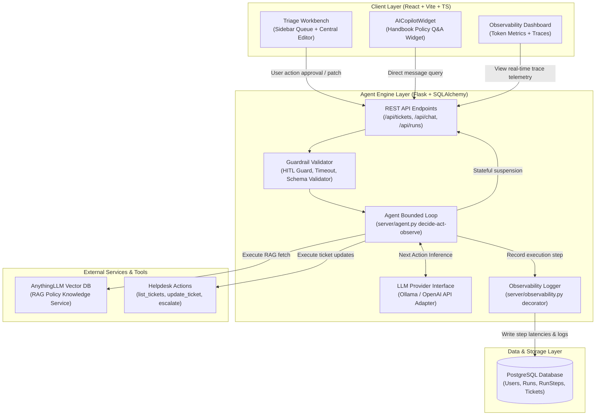

---

## 🌟 Key Engineering Highlights

### 1. Custom Bounded Agent Loop (No Framework Lock-in)
* **First-Principles Design:** Built directly in [`server/agent.py`](./server/agent.py) without heavy black-box orchestrators (e.g. LangChain or AutoGen) to ensure complete transparency.
* **Deterministic Bounds:** Governed by strict step limits (`MAX_AGENT_STEPS = 6`) and tool timeouts (`TOOL_TIMEOUT_SECONDS = 30`) to prevent runaway recursive reasoning loops, hallucinated cycles, or API cost overruns.
* **Schema Validation & Self-Correction:** Model tool calls are checked against JSON schemas before execution. Schema mismatches trigger a structured error response back to the agent with a 1-retry self-correction cap.
* **Transient LLM retries:** Timeouts and 429s retry inside [`server/llm.py`](./server/llm.py) with exponential backoff and jitter, capped so retries cannot stall a run for ~60s.

### 2. Human-in-the-Loop (HITL) Execution Safety
* **Consequential Actions Guarded:** Critical actions (like writing ticket drafts or routing escalations) are marked as `requires_confirmation = True`. 
* **Stateful Resumption:** On identifying a consequential action, the loop halts, saves its state to database logs as a `PendingAction`, and enters a `needs_confirmation` status. It resumes cleanly once the support specialist clicks approve or reject in the UI.

### 3. Decoupled RAG Knowledge Integration
* Implements a vector-index retrieval query via AnythingLLM API behind a clean `search_knowledge` tool interface. This decouples the core reasoning engine from vendor-specific vector store architectures.

### 4. Telemetry & Analytics Dashboard
* **Decorator Telemetry:** Logging decorators in [`server/observability.py`](./server/observability.py) capture completion/prompt tokens, model info, execution latency (in milliseconds), tool parameters, and raw JSON logs.
* **Provider and error type:** Each run records `provider` (`ollama` or `openai_compatible`); failed steps store `error_type` (`Timeout`, `ConnectionError`, …) so traces can tell which backend served the run and why a call failed.
* **Analytical UI:** The Audit Dashboard visualizes token volume trends, failure statistics, trace trees, and latency buckets (20%, 50%, 90% latency percentiles).

### 5. Multi-Tenant Dynamic Company Support (DRY Architecture)
* **Customizable Enterprise Tenants:** Company branding is a dynamic configuration rather than hardcoded strings. Upon specialist registration, organizations can define their company name (e.g. Acme Corp, ApexCare, or TechCorp).
* **Contextual Agent Personalization:** Prompts, copilot greetings, fallback templates, and policy citation sentinels dynamically interpolate the active company tenant, seamlessly decoupling core agentic reasoning from specific corporate domains while preserving out-of-the-box demo fidelity.

### 6. Production-Grade Responsive & Mobile Architecture
* **Hybrid Master-Detail & Contextual Drawers:** Eliminates clumsy responsive squeezing with clean view transitions, iOS safe-area handling (`env(safe-area-inset-bottom)`), and contextual 85% sliding copilot drawers.
* **Scroll-less Views & Strict Scroll Containment:** Outer window locked with zero rubber-banding or duplicate scrollbars (`overflow-hidden`); internal scrolling strictly isolated to conversation and doc streams.
* **Automated Multi-Device Test Suite:** Comprehensive Vitest integration coverage for master-detail flows, tab switching, and touch drawer interactions alongside Pytest backend suites.

---

## 🛡️ AI Safety & Prompt Injection Protection

| Protection Layer | Strategy |
| :--- | :--- |
| **XML Data Isolation** | Retrieval and tool responses are wrapped inside `<tool_result>` XML tags. The system prompt instructs the agent to treat this content strictly as untrusted data, neutralizing instructions inside documents. |
| **Strict Read-Only Queue** | Ticket queue operations are read-only from the user interface; ticket creation and deletion are disabled to preserve the queue as a strict, un-compromised system of record. |
| **Session Isolation** | Token-based session authentication separates workspaces; users are partitioned and cannot access or audit runs from other specialists. |

---

## 🛠️ Tech Stack

| Component | Technology | Role |
| :--- | :--- | :--- |
| **Frontend** | React 18, TypeScript, Vite, Vanilla CSS | Dashboard UI, trace panel, audit graphs |
| **Backend** | Python 3.11+, Flask, SQLAlchemy | Bounded reasoning loop, tool router, state management, REST endpoints |
| **Database** | PostgreSQL 16 / SQLite | Run logs, users, runs, steps, and tickets |
| **LLM Provider** | Ollama (`llama3.1:8b`) / OpenAI | Swap reasoning models via a unified LLM interface |
| **Knowledge Engine** | AnythingLLM (Dockerized) | Vector database, semantic retrieval, indexing |
| **Testing** | Pytest, Vitest | Parallel unit & integration testing |

---

## 🧭 Claude Code Harness (`.claude/`)

This repo ships a small, honest agentic harness under [`.claude/`](./.claude/) so teammates can explore and explain the codebase the same way. Counts match what is actually checked in:

| Kind | Count | Location |
| :--- | :---: | :--- |
| **Hooks** | 1 config (`SessionStart`, `PostToolUse`) | [`.claude/hooks.json`](./.claude/hooks.json) |
| **Skills** | 2 | [`.claude/skills/`](./.claude/skills/) |
| **Subagent** | 1 | [`.claude/agents/`](./.claude/agents/) |
| **Settings** | permissions + default plan mode | [`.claude/settings.json`](./.claude/settings.json) |

* **Hooks** — `SessionStart` opens an exploration-mode notes file; `PostToolUse` on `Read` appends a timestamped line to `./notes/exploration-log.txt`.
* **Skills**
  * [`explain-feature`](./.claude/skills/explain-feature/SKILL.md) — explain a feature with exact file/line citations
  * [`trace-data-flow`](./.claude/skills/trace-data-flow/SKILL.md) — walk a request from entry point to output in runtime order
* **Subagent** — [`code-explorer`](./.claude/agents/code-explorer.md) (Read / Grep / Glob only) returns a structured module summary to the parent agent.

---

## 🚀 Quick Start & Installation

### Prerequisites
* **Docker** (for Postgres and AnythingLLM)
* **Python 3.11+**
* **Node.js 18+** & `npm`
* **Ollama** (for local reasoning model execution)

### 1. Spin up Services (Docker)
```bash
# 1. Spin up AnythingLLM RAG Service (Port 3001)
#    Create a developer API key inside AnythingLLM settings once active.
docker run -d -p 3001:3001 \
  -e STORAGE_DIR="/app/server/storage" \
  -v anythingllm_storage:/app/server/storage \
  --name anythingllm mintplexlabs/anythingllm

# 2. Spin up PostgreSQL DB (Port 5432)
docker run -d -p 5432:5432 \
  -e POSTGRES_PASSWORD=agent \
  -e POSTGRES_DB=agentdb \
  -v agentdb_data:/var/lib/postgresql/data \
  --name agentdb postgres:16
```

### 2. Configure Environment
```bash
# Download the local reasoning model via Ollama
ollama serve
ollama pull llama3.1:8b

# Setup environment variables
cp .env.example .env
# Edit .env with your ANYTHINGLLM_API_KEY, ANYTHINGLLM_WORKSPACE, and DATABASE_URL
```

### 3. Backend Setup (Flask API)
```bash
# Create and activate virtual environment
python -m venv .venv
source .venv/bin/activate

# Install requirements
pip install -r server/requirements.txt

# Run migrations and start backend API (Port 5000)
flask --app server.app db upgrade
flask --app server.app run --debug
```

### 4. Frontend Setup (React App)
```bash
cd client
npm install
npm run dev # Launches at http://localhost:5173
```

---

## 🧪 Testing & Validation

Automated testing enforces code validity on both ends before merge pipelines execute.

```bash
# Run backend python unit/integration tests
.venv/bin/pytest

# Run frontend UI tests
cd client
npm test -- --run
```

### 🎯 Agent Evaluation & Golden Task Set
In addition to automated unit and integration tests, end-to-end agent decision-making, tool routing, and grounded policy retrieval are measured against a concrete 9-task golden set (covering factual policy lookups and graceful out-of-scope refusals). See [`docs/eval.md`](./docs/eval.md) for the benchmark task matrix, scoring criteria, and run logs.

---

## 👥 Authors & Team

<table align="center">
  <tr>
    <td align="center" width="33%">
      <a href="https://github.com/freeleons">
        <br />
        <sub><b>Jameson Wang</b></sub>
      </a>
      <br />
      <a href="https://github.com/freeleons"></a>
      <a href="https://www.linkedin.com/in/freeleons/"></a>
    </td>
    <td align="center" width="33%">
      <a href="https://github.com/shuziyoshi">
        <br />
        <sub><b>Wendy Gong</b></sub>
      </a>
      <br />
      <a href="https://github.com/yoshi182023"></a>
      <a href="https://www.linkedin.com/in/yoshi-gong/"></a>
    </td>
    <td align="center" width="33%">
      <a href="https://github.com/ddgiovinazzo">
        <br />
        <sub><b>Daniel Giovinazzo</b></sub>
      </a>
      <br />
      <a href="https://github.com/ddgiovinazzo"></a>
      <a href="https://www.linkedin.com/in/ddgiovinazzo/"></a>
    </td>
  </tr>
</table>

---

## 📄 License

Distributed under the **MIT License**. See [`LICENSE`](./LICENSE) for details.

